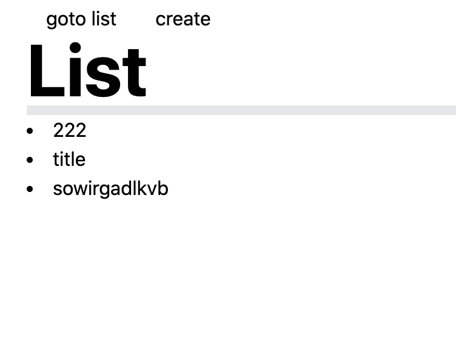
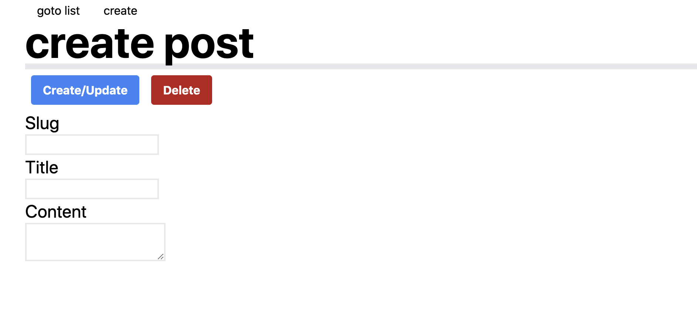
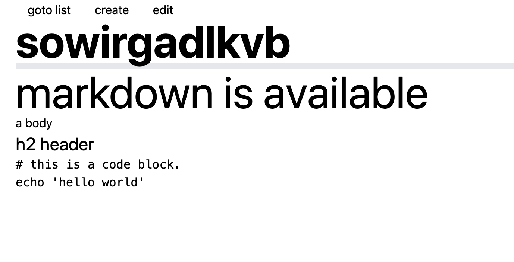
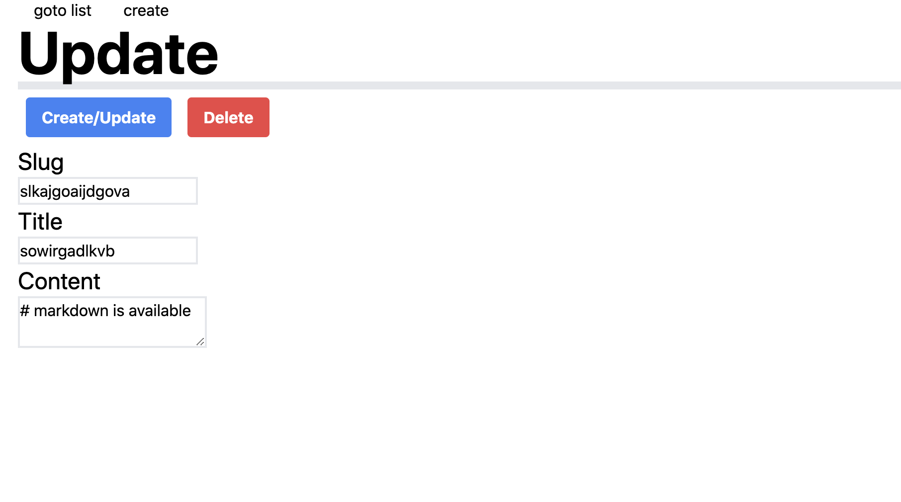

# rust-axum-async-graphal-blog

Rust/axum/async-graphql を使用したブログシステム

---
# 目次

1. 要件と挙動の確認
    - システムの構成
3. 各コンポーネントの詳細
4. 今後の課題

---
# 要件と挙動の確認

1. [構成] Rust/axum/async-graphql を使用した Blog システム
2. [実行環境] 何らかの動作を確認する方法が提供されていること
    - docker-compose で実行が可能
3. [機能] 当該 Blog システムは以下の機能を備えること
    - 一覧取得/投稿/詳細取得/更新/削除
4. [開発環境] git を使用して開発すること
    - github にて開発 → 確認は省略
    - [kaznak/202203.rust-axum-async-graphql-blog](https://github.com/kaznak/202203.rust-axum-async-graphql-blog)

---
# 要件と挙動の確認: [構成]

Rust/axum/async-graphql を使用

`backend/Cargo.toml`

```
async-graphql = "3.0.36"        # ←
async-graphql-axum = "3.0.36"
axum = "0.4"                    # ←
tokio = { version = "1.8", features = ["macros", "rt-multi-thread"] }
hyper = "0.14"
tower-http = { version = "0.2.1", features = ["cors"] }
futures = "0.3.0"
```

---
# 要件と挙動の確認: システムの構成

- バックエンド
    - Rust/axum/async-graphql
    - サーバのバイナリを生成 → コンテナで実行
- フロントエンド
    - next.js/tailwindcss/react-markdown/swr/graphql-request
    - next.js のサーバでリソースを提供

それぞれコンテナで実行、 docker-compose でインテグレーション

---
# 要件と挙動の確認: システムの構成

- バックエンド
    - 投稿データは Markdown でファイルシステムに格納
        - メタデータは frontmatter に格納
- フロントエンド
    - バックエンドへは CORS で接続
    - SSR/SSG はなし

詳細な構成は各コンポーネントの詳細にて確認

---
# 要件と挙動の確認: [実行環境]

docker-compose で実行

実際に実行します。

```
$ docker-compose up
Starting 202203rust-axum-async-graphal-blog_frontend_1 ... done
Starting 202203rust-axum-async-graphal-blog_backend_1  ... done
Attaching to 202203rust-axum-async-graphal-blog_frontend_1, 202203rust-axum-async-graphal-blog_backend_1
backend_1   | Playground: http://localhost:8000
frontend_1  | Listening on port 3000
```

この環境で機能を確認します

---
# 要件と挙動の確認: [機能] 一覧取得

[http://localhost:3000/posts]()



---
# 要件と挙動の確認: [機能] 投稿

ヘッダ部の `create` をクリック
[http://localhost:3000/posts-editor]()



---
# 要件と挙動の確認: [機能] 詳細取得

一覧の記事タイトルをクリック
[http://localhost:3000/posts/slkajgoaijdgova]()



---
# 要件と挙動の確認: [機能] 更新

詳細ページのヘッダの `edit` をクリック
[http://localhost:3000/posts-editor/slkajgoaijdgova]()



---
# 要件と挙動の確認: [機能] 削除

編集ページで `Delete` ボタンをクリック
[http://localhost:3000/posts-editor/slkajgoaijdgova]()


---
# 各コンポーネントの詳細: バックエンド

- HTTP サーバ(`src/main.rs`)
    - `axum`
- GraphQL(`src/graphql/model.rs`)
    - `async-graphql`
- DataStore(`src/datastore/`)
    - `serde-frontmatter`

---
# 各コンポーネントの詳細: バックエンド

- HTTP サーバと GraphQL は[async-graphql 公式 example の axum/upload](https://github.com/async-graphql/examples/tree/6a63808523f7e4995f9111a3497f06921cd3b11b/axum/upload)をベースに使用
- CORS を permissive に変更し、 graphql スキーマを本システム向けに差し替える形で構築した
- 今回複雑な参照関係や強い制約のあるフィールドは slug のみ
    - slug のみ async-graphql の機能を利用してバリデーションを実装
    - 他は String にパースできない時点でエラーを検出できると期待

---
# 各コンポーネントの詳細: バックエンド
- データストアは frontmatter(yaml) 付き markdown ファイルを規定のディレクトリで操作
- frontmatter 部にタイトル等メタデータを記載する想定
- serde ベースのライブラリ(`serde_frontmatter`)を使用して記述をシンプルにした

```
---
title: title

---
# markdown is available
a body
```

---
# 各コンポーネントの詳細: フロントエンド

- Next.js により Web UI を実装
- デザインは tailwindcss
- swr/graphql-request でサーバとやりとり
- SSR/SSG はやっていない

---
# 今後の課題

1. より網羅的なテストの実装
2. 文字列スライスの活用
3. SSR/SSG の実装
4. 各種機能
    - 実はフロントエンドでは create しか使ってないので修正
        - create で既存ポストの上書きをしてしまっている
    - バックエンドを設定ファイルで設定可能に
    - 認証機能
    - 一覧ページのページング機能

---
# 今後の課題: より網羅的なテストの実装

- バックエンドの DataStore の実装ではテストを実行しながら開発を進めた
    - `backend/src/datastore/file.rs`
- 他は手動テストで済ませてしまっている
    - graphql 周りのテストの良い手法を模索中

---
# 今後の課題: 文字列スライスの活用

- バックエンドの DataStore が String をふんだんに使っておりメモリ効率が悪い
- 文字列スライスを活用したい
- どうも `serde_yaml` のライフタイムの指定が間違っているのでは?
    - `serde_yaml` は `serde_frontmatter` でつかわれている。

---
# 今後の課題: 文字列スライスの活用

[Function serde_yaml::from_str](https://docs.rs/serde_yaml/0.8.23/serde_yaml/fn.from_str.html#)
こうなっているが、これはIO等返り値と引数が無関係な場合では?
```
pub fn from_str<T>(s: &str) -> Result<T> 
where
    T: DeserializeOwned,
```
こうでないと、他の構造体由来のスライスを扱えないのでは?
```
pub fn from_str<'de, T>(s: &'de str) -> Result<T> 
where
    T: Deserialize<'de>,
```

`serde_yaml` はまあまあ大きく、しばらく解決は難しそうなので放置。

---
# ありがとうございました
